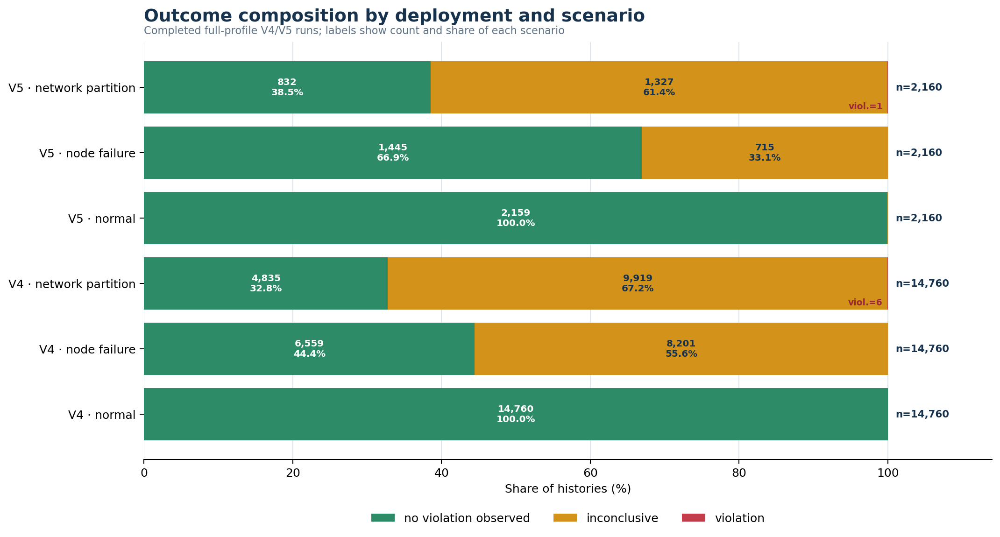
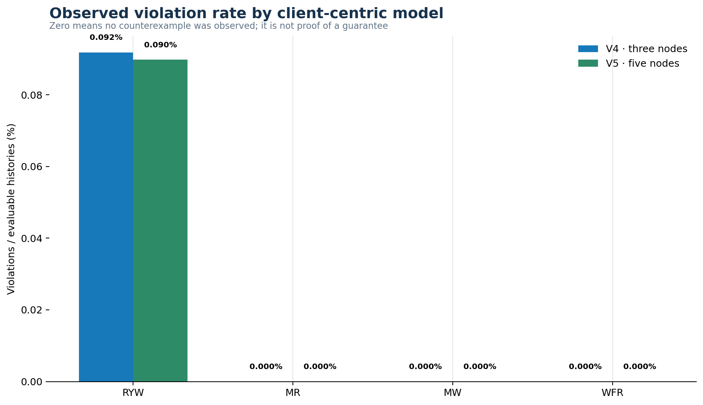
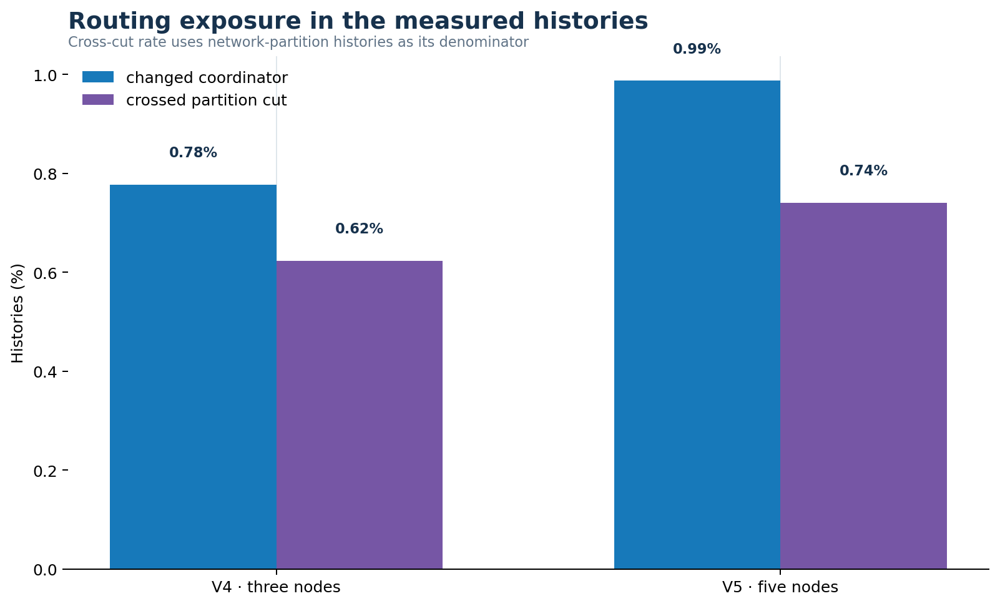
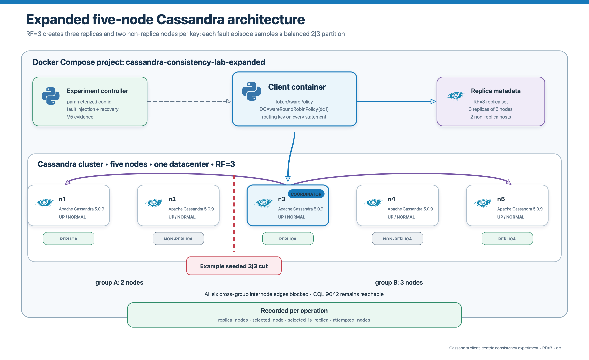

# Cassandra driver-policy violation matrix V5

> **Reporting scope.** This matrix uses only `cassandra-driver-policy-evidence-v4` and `cassandra-driver-policy-evidence-v5`. Historical harness-randomized evidence is deliberately excluded. All run records remain in the CSVs; aggregate tables use completed, structurally valid, full-profile runs only.

## 1. Evidence population

| Deployment | Included runs | Attempted | Evaluable | Violations | No violation observed | Inconclusive | Evaluability | Viol./evaluable |
|---|---|---|---|---|---|---|---|---|
| V4 · three nodes | 5 | 44,280 | 26,160 | 6 | 26,154 | 18,120 | 59.08% | 0.023% |
| V5 · five nodes | 2 | 6,480 | 4,437 | 1 | 4,436 | 2,043 | 68.47% | 0.023% |
| Combined V4 + V5 | 7 | 50,760 | 30,597 | 7 | 30,590 | 20,163 | 60.28% | 0.023% |

- **V4:** three Cassandra nodes, RF=3, token-aware/DC-aware driver routing, seeded 1|2 partition.
- **V5:** five Cassandra nodes, RF=3, token-aware/DC-aware driver routing, seeded balanced 2|3 partition.
- **Denominator:** `violation / (violation + no_violation_observed)`. Inconclusive histories measure unavailable or unexposed observations and are excluded from the violation-rate denominator.

## 2. Run-level audit inventory

| Deployment | Run ID | Profile | Completed | Included | Main histories | Viol. | No viol. | Inconc. | Exclusion/validation note |
|---|---|---|---|---|---|---|---|---|---|
| V4 · three nodes | 20260921T061911Z_000000000135283f | full | false | false | 36 | 0 | 11 | 25 | completion_false |
| V4 · three nodes | 20260921T064120Z_000000000135283f | full | false | false | 36 | 0 | 13 | 23 | completion_false |
| V4 · three nodes | 20260921T080423Z_000000000135283f | full | false | false | 36 | 0 | 9 | 27 | completion_false |
| V4 · three nodes | 20260921T080637Z_00000000000003e9 | smoke | true | false | 108 | 0 | 62 | 46 | smoke_profile |
| V4 · three nodes | 20260921T081729Z_000000000135283f | full | true | true | 1080 | 0 | 637 | 443 | — |
| V4 · three nodes | 20260921T095705Z_000000000135283f | full | true | true | 10800 | 0 | 6366 | 4434 | — |
| V4 · three nodes | 20260921T233512Z_000000000135283f | full | true | true | 10800 | 4 | 6408 | 4388 | — |
| V4 · three nodes | 20260922T093902Z_000000000135283f | full | true | true | 10800 | 1 | 6376 | 4423 | — |
| V4 · three nodes | 20260922T231838Z_000000000135283f | full | true | true | 10800 | 1 | 6367 | 4432 | — |
| V4 · three nodes | 20260923T145032Z_000000000135283f | full | false | false | 1656 | 0 | 978 | 678 | completion_false |
| V5 · five nodes | 20260924T014509Z_000000000135283f | full | true | true | 1080 | 0 | 726 | 354 | — |
| V5 · five nodes | 20260924T025626Z_000000000135283f | full | true | true | 5400 | 1 | 3710 | 1689 | — |
| V5 · five nodes | 20260924T060715Z_000000000135283f | full | false | false | 540 | 0 | 365 | 175 | completion_false |

## 3. Scenario results

| Deployment | Scenario | Attempted | Evaluable | Viol. | Inconc. | Viol./eval. | Assessment |
|---|---|---|---|---|---|---|---|
| V4 · three nodes | normal | 14,760 | 14,760 | 0 | 0 | 0.000% | [x] Expected |
| V4 · three nodes | node failure | 14,760 | 6,559 | 0 | 8,201 | 0.000% | [x] Expected |
| V4 · three nodes | network partition | 14,760 | 4,841 | 6 | 9,919 | 0.124% | [x] Mechanistically plausible |
| V5 · five nodes | normal | 2,160 | 2,159 | 0 | 1 | 0.000% | [x] Expected |
| V5 · five nodes | node failure | 2,160 | 1,445 | 0 | 715 | 0.000% | [x] Expected |
| V5 · five nodes | network partition | 2,160 | 833 | 1 | 1,327 | 0.120% | [x] Mechanistically plausible |

- [x] **Normal operation:** no counterexample is expected in short sequential histories after successful ALL initialization; any observed violation would require trace review.
- [x] **Node failure:** the dominant effect should be unavailability when required replicas cannot respond. A zero violation count does not mean every operation completed.
- [x] **Network partition:** weak or non-intersecting response paths can expose divergent partition-side state. Every saved violation occurred here.

## 4. Client-centric model results

| Deployment | Model | Attempted | Evaluable | Viol. | Inconc. | Viol./eval. |
|---|---|---|---|---|---|---|
| V4 · three nodes | RYW | 11,070 | 6,534 | 6 | 4,536 | 0.092% |
| V4 · three nodes | MR | 11,070 | 6,536 | 0 | 4,534 | 0.000% |
| V4 · three nodes | MW | 11,070 | 6,539 | 0 | 4,531 | 0.000% |
| V4 · three nodes | WFR | 11,070 | 6,551 | 0 | 4,519 | 0.000% |
| V5 · five nodes | RYW | 1,620 | 1,114 | 1 | 506 | 0.090% |
| V5 · five nodes | MR | 1,620 | 1,107 | 0 | 513 | 0.000% |
| V5 · five nodes | MW | 1,620 | 1,096 | 0 | 524 | 0.000% |
| V5 · five nodes | WFR | 1,620 | 1,120 | 0 | 500 | 0.000% |

- [x] **RYW witnesses are meaningful:** all required operations completed and the later read omitted the client's acknowledged write.
- [ ] **No MR/MW/WFR witness is not a guarantee:** these models require a more specific sequence than RYW, including an exposed first read, visible successor, or visible dependency followed by regression/loss.
- [x] **Low route-change exposure is a material explanation:** stable driver query-plan state reduces the chance that successive operations traverse inconsistent partition sides.

## 5. Consistency-level matrix

| Write/read CL | V4 viol. | V4 evaluable | V4 rate | V5 viol. | V5 evaluable | V5 rate |
|---|---|---|---|---|---|---|
| ONE/ONE | 3 | 4,904 | 0.061% | 1 | 717 | 0.139% |
| ONE/QUORUM | 1 | 4,361 | 0.023% | 0 | 639 | 0.000% |
| ONE/ALL | 0 | 1,640 | 0.000% | 0 | 350 | 0.000% |
| QUORUM/ONE | 2 | 4,343 | 0.046% | 0 | 642 | 0.000% |
| QUORUM/QUORUM | 0 | 4,352 | 0.000% | 0 | 652 | 0.000% |
| QUORUM/ALL | 0 | 1,640 | 0.000% | 0 | 354 | 0.000% |
| ALL/ONE | 0 | 1,640 | 0.000% | 0 | 358 | 0.000% |
| ALL/QUORUM | 0 | 1,640 | 0.000% | 0 | 359 | 0.000% |
| ALL/ALL | 0 | 1,640 | 0.000% | 0 | 366 | 0.000% |

- [x] `ONE/ONE` supplies no write/read intersection requirement and produced witnesses in both deployments.
- [x] `QUORUM/ONE` and `ONE/QUORUM` can still expose a weak side of the operation pair; V4 produced finite RYW witnesses in these cells.
- [x] Cells involving `ALL` or intersecting quorum paths often became unavailable during faults, reducing evaluable histories rather than creating successful stale observations.

## 6. Routing and partition exposure

| Deployment | All histories | Changed coordinator | Changed % | Partition histories | Crossed cut | Crossed % |
|---|---|---|---|---|---|---|
| V4 · three nodes | 44,280 | 344 | 0.78% | 14,760 | 92 | 0.62% |
| V5 · five nodes | 6,480 | 64 | 0.99% | 2,160 | 16 | 0.74% |

- V5 recorded **19,420** operations coordinated by a replica and **20** by a non-replica across **19,440** measured operations.
- The five-node design creates real replica/non-replica choice, but token-aware routing correctly prefers the RF=3 replica set. Therefore, adding nodes does not automatically create frequent coordinator changes.
- A route change is an exposure variable, not a consistency violation. A violation also requires completed operations and a value sequence contradicting the model oracle.

## 7. Violation witness inventory

| Deployment | Run ID | Scenario | CL | Model | Coordinator sequence | Changed | Crossed cut | Partition groups |
|---|---|---|---|---|---|---|---|---|
| V4 · three nodes | 20260921T233512Z_000000000135283f | network partition | ONE/ONE | RYW | n2|n3 | true | true | 1|2 isolated-node evidence |
| V4 · three nodes | 20260921T233512Z_000000000135283f | network partition | QUORUM/ONE | RYW | n2|n3 | true | true | 1|2 isolated-node evidence |
| V4 · three nodes | 20260921T233512Z_000000000135283f | network partition | ONE/QUORUM | RYW | n1|n2 | true | true | 1|2 isolated-node evidence |
| V4 · three nodes | 20260921T233512Z_000000000135283f | network partition | ONE/ONE | RYW | n2|n1 | true | true | 1|2 isolated-node evidence |
| V4 · three nodes | 20260922T093902Z_000000000135283f | network partition | QUORUM/ONE | RYW | n1|n3 | true | true | 1|2 isolated-node evidence |
| V4 · three nodes | 20260922T231838Z_000000000135283f | network partition | ONE/ONE | RYW | n2|n3 | true | true | 1|2 isolated-node evidence |
| V5 · five nodes | 20260924T025626Z_000000000135283f | network partition | ONE/ONE | RYW | n1|n4 | true | true | [["n2","n4"],["n1","n3","n5"]] |

All seven witnesses are RYW histories during network partitions. Six are V4 witnesses and one is a V5 witness. The V5 trace changed coordinator from `n1` to `n4` across groups `n1,n3,n5` and `n2,n4`, then observed a state that omitted the acknowledged write.

## 8. Why histories were inconclusive

| Deployment | First failure or oracle reason | Histories | Share of inconclusive |
|---|---|---|---|
| V4 · three nodes | Unavailable | 17,986 | 99.26% |
| V4 · three nodes | ReadTimeout | 58 | 0.32% |
| V4 · three nodes | NoHostAvailable | 36 | 0.20% |
| V4 · three nodes | WriteTimeout | 34 | 0.19% |
| V4 · three nodes | Oracle precondition not exposed | 6 | 0.03% |
| V5 · five nodes | Unavailable | 2,038 | 99.76% |
| V5 · five nodes | Oracle precondition not exposed | 5 | 0.24% |

- [x] `Unavailable` is expected when the coordinator can prove that the requested replica count cannot be reached.
- [x] Timeouts and `NoHostAvailable` are availability outcomes. They are not counted as consistency violations because the oracle lacks the required completed observations.
- [x] Oracle-precondition failures are also inconclusive: WFR needs the dependency to be observed, MW needs the successor to be exposed, and MR needs a usable first read before a regression can be tested.

## 9. Five-node architecture

- Five nodes run in one Docker Compose project and one datacenter (`dc1`).
- RF remains 3, so each partition key maps to three replicas and two non-replica nodes.
- Each network-partition episode samples a seeded 2|3 grouping and blocks all six cross-group internode edges while preserving CQL reachability.
- V5 operation records include `replica_nodes`, `selected_node`, `selected_is_replica`, and `attempted_nodes`.

## 10. Academic interpretation

- **Supported:** weak paths under established network partitions can violate RYW in finite completed histories.
- **Supported:** failures chiefly reduced availability; inconclusive histories must remain outside the violation-rate denominator.
- **Supported:** the V5 design confirms a five-node/RF=3 setup can produce a cross-cut RYW witness while retaining token-aware routing.
- **Not supported:** token-aware routing guarantees RYW, MR, MW, or WFR.
- **Not supported:** MR, MW, or WFR always hold. The experiment observed no witness in the measured schedules.
- **Not supported:** adding nodes directly weakens consistency. It changes replica placement and sampled schedules; consistency level, timing, and route sequence still determine the observable history.

## 11. Reproducibility

- Trial source: `report/report_generation/trial_level_evidence.csv`
- Run source: `report/report_generation/run_level_violation_matrix.csv`
- Derived summary: `report/report_generation/v5_analysis_summary.json`
- Builder: `report/report_generation/build_v5_report_assets.py`
- Export integrity: `python3 report/report_generation/verify_exports.py`
