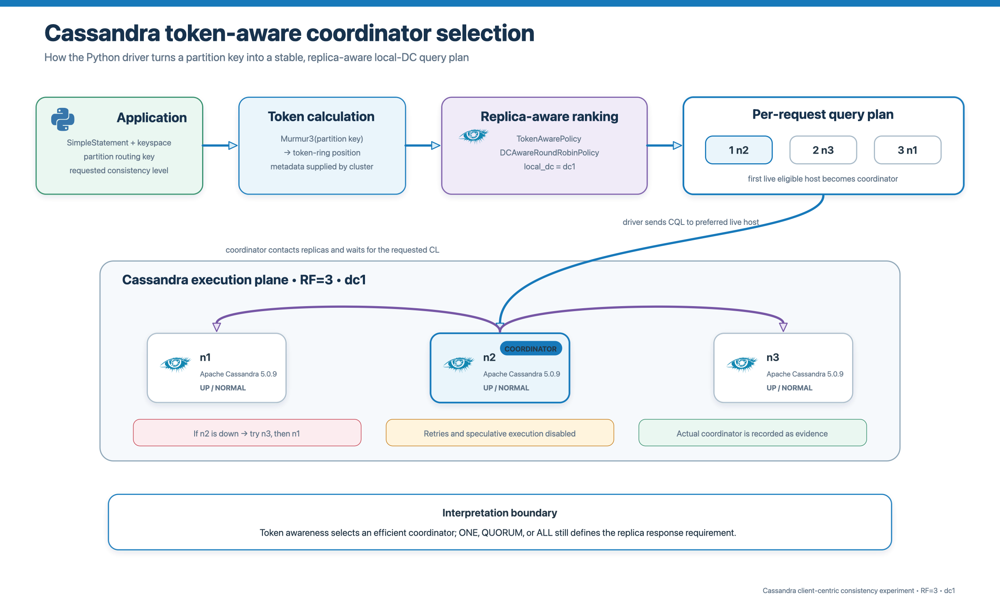
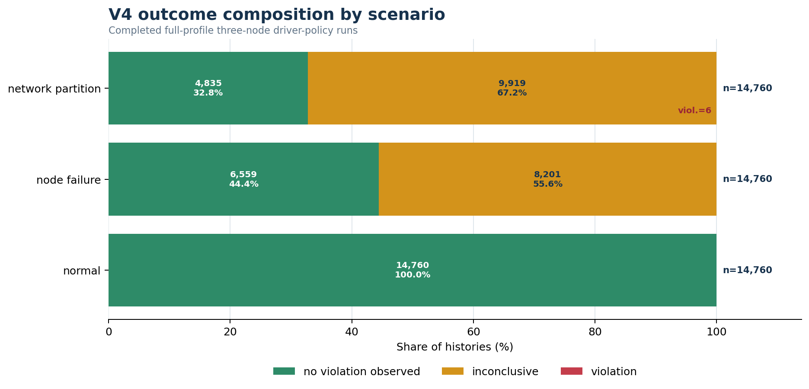
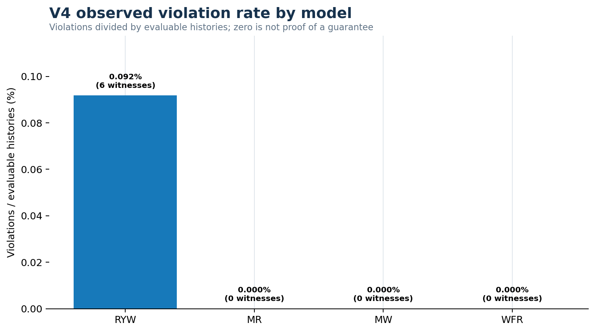
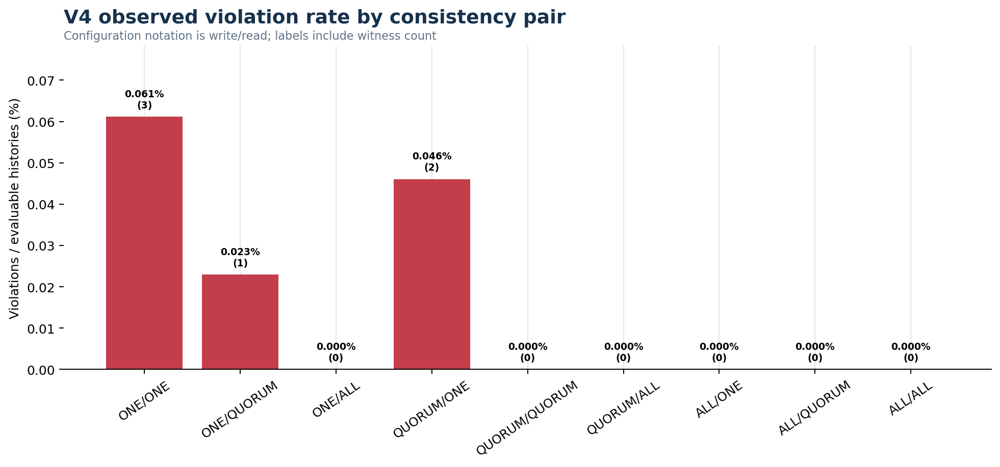

# Cassandra driver-policy violation matrix V7 — V4 only

> **Scope.** This document reports only `cassandra-driver-policy-evidence-v4` produced by design `cassandra-driver-policy-v3`. Aggregates use completed, structurally valid, full-profile runs. Smoke and incomplete V4 runs appear only in the audit inventory.

## 1. Experimental setup

- **Cluster:** three Cassandra nodes (`n1`, `n2`, `n3`) in one datacenter (`dc1`).
- **Replication:** `NetworkTopologyStrategy`, RF=3; every node is a replica for each experiment key.
- **Routing:** `TokenAwarePolicy(DCAwareRoundRobinPolicy(local_dc="dc1"))`; the application supplies a routing key and does not select a coordinator.
- **Scenarios:** normal operation, one abrupt node failure, and an established 1|2 internode network partition.
- **Consistency pairs:** the notation is write/read consistency over `ONE`, `QUORUM`, and `ALL`.
- **Models:** RYW, MR, MW, and WFR.

## 2. Evidence population

| Included full runs | Attempted | Evaluable | Violations | No violation observed | Inconclusive | Evaluability | Viol./evaluable |
|---|---|---|---|---|---|---|---|
| 5 | 44,280 | 26,160 | 6 | 26,154 | 18,120 | 59.08% | 0.023% |

- **Primary denominator:** `violation / (violation + no_violation_observed)`.
- Inconclusive histories are retained for availability and coverage analysis but excluded from the violation-rate denominator.
- A no-violation outcome describes one finite history; it is not proof of a universal Cassandra guarantee.

## 3. Run-level audit inventory

| Run ID | Profile | Completed | Included | Main histories | Viol. | No viol. | Inconc. | Note |
|---|---|---|---|---|---|---|---|---|
| 20260921T061911Z_000000000135283f | full | false | false | 36 | 0 | 11 | 25 | completion_false |
| 20260921T064120Z_000000000135283f | full | false | false | 36 | 0 | 13 | 23 | completion_false |
| 20260921T080423Z_000000000135283f | full | false | false | 36 | 0 | 9 | 27 | completion_false |
| 20260921T080637Z_00000000000003e9 | smoke | true | false | 108 | 0 | 62 | 46 | smoke_profile |
| 20260921T081729Z_000000000135283f | full | true | true | 1080 | 0 | 637 | 443 | — |
| 20260921T095705Z_000000000135283f | full | true | true | 10800 | 0 | 6366 | 4434 | — |
| 20260921T233512Z_000000000135283f | full | true | true | 10800 | 4 | 6408 | 4388 | — |
| 20260922T093902Z_000000000135283f | full | true | true | 10800 | 1 | 6376 | 4423 | — |
| 20260922T231838Z_000000000135283f | full | true | true | 10800 | 1 | 6367 | 4432 | — |
| 20260923T145032Z_000000000135283f | full | false | false | 1656 | 0 | 978 | 678 | completion_false |

The five rows with `Included=true` form every aggregate below. The smoke run and four incomplete runs do not contribute to any result denominator.

## 4. Outcomes by scenario

| Scenario | Attempted | Evaluable | Viol. | No viol. | Inconc. | Viol./eval. | Assessment |
|---|---|---|---|---|---|---|---|
| normal | 14,760 | 14,760 | 0 | 14,760 | 0 | 0.000% | [x] Expected |
| node failure | 14,760 | 6,559 | 0 | 6,559 | 8,201 | 0.000% | [x] Expected |
| network partition | 14,760 | 4,841 | 6 | 4,835 | 9,919 | 0.124% | [x] Mechanistically plausible |

- [x] **Normal operation:** all histories were evaluable and no counterexample was observed.
- [x] **Node failure:** the dominant effect was unavailability when the required replica count could not be reached; no successful stale witness was recorded.
- [x] **Network partition:** all six counterexamples occurred here and crossed the recorded cut.

## 5. Client-centric model findings

| Model | Attempted | Evaluable | Viol. | No viol. | Inconc. | Viol./eval. |
|---|---|---|---|---|---|---|
| RYW | 11,070 | 6,534 | 6 | 6,528 | 4,536 | 0.092% |
| MR | 11,070 | 6,536 | 0 | 6,536 | 4,534 | 0.000% |
| MW | 11,070 | 6,539 | 0 | 6,539 | 4,531 | 0.000% |
| WFR | 11,070 | 6,551 | 0 | 6,551 | 4,519 | 0.000% |

- [x] **RYW:** six finite counterexamples show that token-aware routing does not itself provide read-your-writes across a partition.
- [ ] **MR, MW, and WFR:** no counterexample was observed. This is not a guarantee; each oracle requires a specific completed regression or causal-visibility pattern.
- Stable query-plan order and operation unavailability reduced the number of histories that changed coordinator and crossed the cut.

## 6. Consistency-level results

| Write/read CL | Attempted | Evaluable | Viol. | Inconc. | Viol./eval. |
|---|---|---|---|---|---|
| ONE/ONE | 4,920 | 4,904 | 3 | 16 | 0.061% |
| ONE/QUORUM | 4,920 | 4,361 | 1 | 559 | 0.023% |
| ONE/ALL | 4,920 | 1,640 | 0 | 3,280 | 0.000% |
| QUORUM/ONE | 4,920 | 4,343 | 2 | 577 | 0.046% |
| QUORUM/QUORUM | 4,920 | 4,352 | 0 | 568 | 0.000% |
| QUORUM/ALL | 4,920 | 1,640 | 0 | 3,280 | 0.000% |
| ALL/ONE | 4,920 | 1,640 | 0 | 3,280 | 0.000% |
| ALL/QUORUM | 4,920 | 1,640 | 0 | 3,280 | 0.000% |
| ALL/ALL | 4,920 | 1,640 | 0 | 3,280 | 0.000% |

- [x] `ONE/ONE` has no acknowledgement/read intersection requirement and produced three witnesses.
- [x] `ONE/QUORUM` and `QUORUM/ONE` do not satisfy `W + R > RF` for RF=3 and produced one and two witnesses respectively.
- [x] `QUORUM/QUORUM` satisfies `2 + 2 > 3` and produced no witness in the measured histories.
- [x] Configurations involving `ALL` frequently became unavailable during faults, reducing evaluability instead of producing successful stale observations.

## 7. Routing and fault exposure

| All histories | Changed coordinator | Changed % | Partition histories | Crossed cut | Crossed % |
|---|---|---|---|---|---|
| 44,280 | 344 | 0.78% | 14,760 | 92 | 0.62% |

- A coordinator change is an exposure variable, not a violation.
- A valid counterexample also requires successful operations and a returned value sequence rejected by the model oracle.
- All three nodes are replicas at RF=3; token awareness therefore ranks only replica nodes in this topology.

## 8. Violation witness inventory

| Run ID | Trial ID | CL | Model | Coordinator sequence | Changed | Crossed cut | Oracle reason |
|---|---|---|---|---|---|---|---|
| 20260921T233512Z_000000000135283f | 20260921T233512Z_000000000135283f:network_partition:18:ONE/ONE:RYW | ONE/ONE | RYW | n2|n3 | true | true | Later read omitted acknowledged write |
| 20260921T233512Z_000000000135283f | 20260921T233512Z_000000000135283f:network_partition:32:QUORUM/ONE:RYW | QUORUM/ONE | RYW | n2|n3 | true | true | Later read omitted acknowledged write |
| 20260921T233512Z_000000000135283f | 20260921T233512Z_000000000135283f:network_partition:64:ONE/QUORUM:RYW | ONE/QUORUM | RYW | n1|n2 | true | true | Later read omitted acknowledged write |
| 20260921T233512Z_000000000135283f | 20260921T233512Z_000000000135283f:network_partition:67:ONE/ONE:RYW | ONE/ONE | RYW | n2|n1 | true | true | Later read omitted acknowledged write |
| 20260922T093902Z_000000000135283f | 20260922T093902Z_000000000135283f:network_partition:32:QUORUM/ONE:RYW | QUORUM/ONE | RYW | n1|n3 | true | true | Later read omitted acknowledged write |
| 20260922T231838Z_000000000135283f | 20260922T231838Z_000000000135283f:network_partition:36:ONE/ONE:RYW | ONE/ONE | RYW | n2|n3 | true | true | Later read omitted acknowledged write |

All six witnesses are RYW histories during a network partition. Each changed coordinator and crossed the 1|2 fault cut before the later read omitted the acknowledged write.

## 9. Why histories were inconclusive

| First failure or oracle reason | Histories | Share | Classification |
|---|---|---|---|
| Unavailable | 17,986 | 99.26% | Availability outcome |
| ReadTimeout | 58 | 0.32% | Availability outcome |
| NoHostAvailable | 36 | 0.20% | Availability outcome |
| WriteTimeout | 34 | 0.19% | Availability outcome |
| Oracle precondition not exposed | 6 | 0.03% | Coverage exclusion |

- [x] `Unavailable` is expected when the coordinator can prove that too few replicas are reachable for the requested consistency level.
- [x] `ReadTimeout`, `WriteTimeout`, and `NoHostAvailable` are availability outcomes, not consistency violations.
- [x] Missing oracle preconditions are coverage exclusions: the required successful dependency, successor, or first read was not exposed.

## 10. Expected-behaviour assessment

- **Expected:** zero normal-operation violations in these initialized short histories.
- **Expected:** high fault-time unavailability for `ALL` and for requests unable to reach two replicas at `QUORUM`.
- **Mechanistically plausible:** RYW witnesses at `ONE/ONE`, `ONE/QUORUM`, and `QUORUM/ONE` when successful operations use different partition sides.
- **Supported:** token-aware routing changes coordinator selection but does not strengthen the selected consistency level.
- **Not established:** MR, MW, or WFR always hold. Zero observed witnesses only bounds this measured workload.

## 11. Limitations

- Containers share one physical host and do not reproduce independent-machine clocks, disks, racks, or wide-area latency.
- The five included runs have unequal sizes, so histories are pooled as finite evidence rather than treated as a balanced causal estimate.
- Fault episodes contain many trial cells; histories inside one episode are not independent fault realizations.
- The driver commonly retained a coordinator within a short history, producing only 344 coordinator-changing histories.
- The finite oracles detect concrete witnesses; they do not exhaust all possible executions.

## 12. Detailed outcome matrix

Legend: **viol.** = violation; **no viol.** = no violation observed; **inconc.** = operation failure or missing oracle precondition.

| Model | Write/read CL | Scenario | Viol. | No viol. | Inconc. | Evaluable | Total | Viol./eval. |
|---|---|---|---|---|---|---|---|---|
| RYW | ONE/ONE | normal | 0 | 410 | 0 | 410 | 410 | 0.000% |
| RYW | ONE/ONE | node failure | 0 | 410 | 0 | 410 | 410 | 0.000% |
| RYW | ONE/ONE | network partition | 3 | 403 | 4 | 406 | 410 | 0.739% |
| RYW | ONE/QUORUM | normal | 0 | 410 | 0 | 410 | 410 | 0.000% |
| RYW | ONE/QUORUM | node failure | 0 | 410 | 0 | 410 | 410 | 0.000% |
| RYW | ONE/QUORUM | network partition | 1 | 272 | 137 | 273 | 410 | 0.366% |
| RYW | ONE/ALL | normal | 0 | 410 | 0 | 410 | 410 | 0.000% |
| RYW | ONE/ALL | node failure | 0 | 0 | 410 | 0 | 410 | N/A |
| RYW | ONE/ALL | network partition | 0 | 0 | 410 | 0 | 410 | N/A |
| RYW | QUORUM/ONE | normal | 0 | 410 | 0 | 410 | 410 | 0.000% |
| RYW | QUORUM/ONE | node failure | 0 | 410 | 0 | 410 | 410 | 0.000% |
| RYW | QUORUM/ONE | network partition | 2 | 259 | 149 | 261 | 410 | 0.766% |
| RYW | QUORUM/QUORUM | normal | 0 | 410 | 0 | 410 | 410 | 0.000% |
| RYW | QUORUM/QUORUM | node failure | 0 | 410 | 0 | 410 | 410 | 0.000% |
| RYW | QUORUM/QUORUM | network partition | 0 | 264 | 146 | 264 | 410 | 0.000% |
| RYW | QUORUM/ALL | normal | 0 | 410 | 0 | 410 | 410 | 0.000% |
| RYW | QUORUM/ALL | node failure | 0 | 0 | 410 | 0 | 410 | N/A |
| RYW | QUORUM/ALL | network partition | 0 | 0 | 410 | 0 | 410 | N/A |
| RYW | ALL/ONE | normal | 0 | 410 | 0 | 410 | 410 | 0.000% |
| RYW | ALL/ONE | node failure | 0 | 0 | 410 | 0 | 410 | N/A |
| RYW | ALL/ONE | network partition | 0 | 0 | 410 | 0 | 410 | N/A |
| RYW | ALL/QUORUM | normal | 0 | 410 | 0 | 410 | 410 | 0.000% |
| RYW | ALL/QUORUM | node failure | 0 | 0 | 410 | 0 | 410 | N/A |
| RYW | ALL/QUORUM | network partition | 0 | 0 | 410 | 0 | 410 | N/A |
| RYW | ALL/ALL | normal | 0 | 410 | 0 | 410 | 410 | 0.000% |
| RYW | ALL/ALL | node failure | 0 | 0 | 410 | 0 | 410 | N/A |
| RYW | ALL/ALL | network partition | 0 | 0 | 410 | 0 | 410 | N/A |
| MR | ONE/ONE | normal | 0 | 410 | 0 | 410 | 410 | 0.000% |
| MR | ONE/ONE | node failure | 0 | 410 | 0 | 410 | 410 | 0.000% |
| MR | ONE/ONE | network partition | 0 | 408 | 2 | 408 | 410 | 0.000% |
| MR | ONE/QUORUM | normal | 0 | 410 | 0 | 410 | 410 | 0.000% |
| MR | ONE/QUORUM | node failure | 0 | 410 | 0 | 410 | 410 | 0.000% |
| MR | ONE/QUORUM | network partition | 0 | 273 | 137 | 273 | 410 | 0.000% |
| MR | ONE/ALL | normal | 0 | 410 | 0 | 410 | 410 | 0.000% |
| MR | ONE/ALL | node failure | 0 | 0 | 410 | 0 | 410 | N/A |
| MR | ONE/ALL | network partition | 0 | 0 | 410 | 0 | 410 | N/A |
| MR | QUORUM/ONE | normal | 0 | 410 | 0 | 410 | 410 | 0.000% |
| MR | QUORUM/ONE | node failure | 0 | 410 | 0 | 410 | 410 | 0.000% |
| MR | QUORUM/ONE | network partition | 0 | 258 | 152 | 258 | 410 | 0.000% |
| MR | QUORUM/QUORUM | normal | 0 | 410 | 0 | 410 | 410 | 0.000% |
| MR | QUORUM/QUORUM | node failure | 0 | 410 | 0 | 410 | 410 | 0.000% |
| MR | QUORUM/QUORUM | network partition | 0 | 267 | 143 | 267 | 410 | 0.000% |
| MR | QUORUM/ALL | normal | 0 | 410 | 0 | 410 | 410 | 0.000% |
| MR | QUORUM/ALL | node failure | 0 | 0 | 410 | 0 | 410 | N/A |
| MR | QUORUM/ALL | network partition | 0 | 0 | 410 | 0 | 410 | N/A |
| MR | ALL/ONE | normal | 0 | 410 | 0 | 410 | 410 | 0.000% |
| MR | ALL/ONE | node failure | 0 | 0 | 410 | 0 | 410 | N/A |
| MR | ALL/ONE | network partition | 0 | 0 | 410 | 0 | 410 | N/A |
| MR | ALL/QUORUM | normal | 0 | 410 | 0 | 410 | 410 | 0.000% |
| MR | ALL/QUORUM | node failure | 0 | 0 | 410 | 0 | 410 | N/A |
| MR | ALL/QUORUM | network partition | 0 | 0 | 410 | 0 | 410 | N/A |
| MR | ALL/ALL | normal | 0 | 410 | 0 | 410 | 410 | 0.000% |
| MR | ALL/ALL | node failure | 0 | 0 | 410 | 0 | 410 | N/A |
| MR | ALL/ALL | network partition | 0 | 0 | 410 | 0 | 410 | N/A |
| MW | ONE/ONE | normal | 0 | 410 | 0 | 410 | 410 | 0.000% |
| MW | ONE/ONE | node failure | 0 | 410 | 0 | 410 | 410 | 0.000% |
| MW | ONE/ONE | network partition | 0 | 406 | 4 | 406 | 410 | 0.000% |
| MW | ONE/QUORUM | normal | 0 | 410 | 0 | 410 | 410 | 0.000% |
| MW | ONE/QUORUM | node failure | 0 | 410 | 0 | 410 | 410 | 0.000% |
| MW | ONE/QUORUM | network partition | 0 | 258 | 152 | 258 | 410 | 0.000% |
| MW | ONE/ALL | normal | 0 | 410 | 0 | 410 | 410 | 0.000% |
| MW | ONE/ALL | node failure | 0 | 0 | 410 | 0 | 410 | N/A |
| MW | ONE/ALL | network partition | 0 | 0 | 410 | 0 | 410 | N/A |
| MW | QUORUM/ONE | normal | 0 | 410 | 0 | 410 | 410 | 0.000% |
| MW | QUORUM/ONE | node failure | 0 | 410 | 0 | 410 | 410 | 0.000% |
| MW | QUORUM/ONE | network partition | 0 | 268 | 142 | 268 | 410 | 0.000% |
| MW | QUORUM/QUORUM | normal | 0 | 410 | 0 | 410 | 410 | 0.000% |
| MW | QUORUM/QUORUM | node failure | 0 | 410 | 0 | 410 | 410 | 0.000% |
| MW | QUORUM/QUORUM | network partition | 0 | 277 | 133 | 277 | 410 | 0.000% |
| MW | QUORUM/ALL | normal | 0 | 410 | 0 | 410 | 410 | 0.000% |
| MW | QUORUM/ALL | node failure | 0 | 0 | 410 | 0 | 410 | N/A |
| MW | QUORUM/ALL | network partition | 0 | 0 | 410 | 0 | 410 | N/A |
| MW | ALL/ONE | normal | 0 | 410 | 0 | 410 | 410 | 0.000% |
| MW | ALL/ONE | node failure | 0 | 0 | 410 | 0 | 410 | N/A |
| MW | ALL/ONE | network partition | 0 | 0 | 410 | 0 | 410 | N/A |
| MW | ALL/QUORUM | normal | 0 | 410 | 0 | 410 | 410 | 0.000% |
| MW | ALL/QUORUM | node failure | 0 | 0 | 410 | 0 | 410 | N/A |
| MW | ALL/QUORUM | network partition | 0 | 0 | 410 | 0 | 410 | N/A |
| MW | ALL/ALL | normal | 0 | 410 | 0 | 410 | 410 | 0.000% |
| MW | ALL/ALL | node failure | 0 | 0 | 410 | 0 | 410 | N/A |
| MW | ALL/ALL | network partition | 0 | 0 | 410 | 0 | 410 | N/A |
| WFR | ONE/ONE | normal | 0 | 410 | 0 | 410 | 410 | 0.000% |
| WFR | ONE/ONE | node failure | 0 | 409 | 1 | 409 | 410 | 0.000% |
| WFR | ONE/ONE | network partition | 0 | 405 | 5 | 405 | 410 | 0.000% |
| WFR | ONE/QUORUM | normal | 0 | 410 | 0 | 410 | 410 | 0.000% |
| WFR | ONE/QUORUM | node failure | 0 | 410 | 0 | 410 | 410 | 0.000% |
| WFR | ONE/QUORUM | network partition | 0 | 277 | 133 | 277 | 410 | 0.000% |
| WFR | ONE/ALL | normal | 0 | 410 | 0 | 410 | 410 | 0.000% |
| WFR | ONE/ALL | node failure | 0 | 0 | 410 | 0 | 410 | N/A |
| WFR | ONE/ALL | network partition | 0 | 0 | 410 | 0 | 410 | N/A |
| WFR | QUORUM/ONE | normal | 0 | 410 | 0 | 410 | 410 | 0.000% |
| WFR | QUORUM/ONE | node failure | 0 | 410 | 0 | 410 | 410 | 0.000% |
| WFR | QUORUM/ONE | network partition | 0 | 276 | 134 | 276 | 410 | 0.000% |
| WFR | QUORUM/QUORUM | normal | 0 | 410 | 0 | 410 | 410 | 0.000% |
| WFR | QUORUM/QUORUM | node failure | 0 | 410 | 0 | 410 | 410 | 0.000% |
| WFR | QUORUM/QUORUM | network partition | 0 | 264 | 146 | 264 | 410 | 0.000% |
| WFR | QUORUM/ALL | normal | 0 | 410 | 0 | 410 | 410 | 0.000% |
| WFR | QUORUM/ALL | node failure | 0 | 0 | 410 | 0 | 410 | N/A |
| WFR | QUORUM/ALL | network partition | 0 | 0 | 410 | 0 | 410 | N/A |
| WFR | ALL/ONE | normal | 0 | 410 | 0 | 410 | 410 | 0.000% |
| WFR | ALL/ONE | node failure | 0 | 0 | 410 | 0 | 410 | N/A |
| WFR | ALL/ONE | network partition | 0 | 0 | 410 | 0 | 410 | N/A |
| WFR | ALL/QUORUM | normal | 0 | 410 | 0 | 410 | 410 | 0.000% |
| WFR | ALL/QUORUM | node failure | 0 | 0 | 410 | 0 | 410 | N/A |
| WFR | ALL/QUORUM | network partition | 0 | 0 | 410 | 0 | 410 | N/A |
| WFR | ALL/ALL | normal | 0 | 410 | 0 | 410 | 410 | 0.000% |
| WFR | ALL/ALL | node failure | 0 | 0 | 410 | 0 | 410 | N/A |
| WFR | ALL/ALL | network partition | 0 | 0 | 410 | 0 | 410 | N/A |

## 13. Reproducibility

- Trial source: `report/report_generation/trial_level_evidence.csv`
- Run source: `report/report_generation/run_level_violation_matrix.csv`
- Derived summary: `report/report_generation/v7_analysis_summary.json`
- Builder: `report/report_generation/build_v7_report_assets.py`
- Export integrity: `python3 report/report_generation/verify_exports.py`
